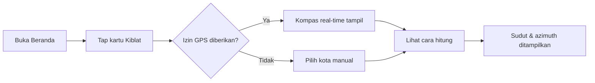
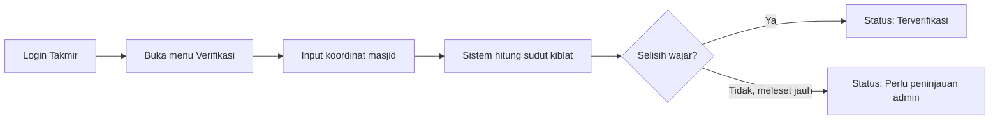

# Product Requirements Document: SIFA MVP

## Executive Summary

**Product:** SIFA (Sistem Informasi Falak Terintegrasi)
**Version:** MVP (1.0)
**Document Status:** Draft — siap direview sebelum masuk Technical Design
**Last Updated:** 18 Juli 2026

### Product Vision
SIFA menyatukan tiga kebutuhan ibadah yang selama ini tersebar di aplikasi/sumber berbeda — arah kiblat, jadwal waktu salat, dan kalender Hijriah — ke dalam satu produk web + mobile yang metode hisabnya transparan (mengikuti Pedoman Hisab Muhammadiyah dan KHGT), dilengkapi lapisan edukasi Ilmu Falak dan layanan verifikasi kiblat untuk masjid/musala Amal Usaha Muhammadiyah (AUM). Proyek ini dikembangkan sebagai bagian dari PKM AIK berbasis Ilmu Falak, CPMK 8, Modul AIK IV Fakultas Teknik, Unismuh Makassar.

### Success Criteria
MVP dianggap berhasil bila: (1) mesin hisab kiblat lolos uji terhadap contoh soal resmi modul, (2) minimal 3 masjid AUM terverifikasi arah kiblatnya lewat aplikasi, (3) aplikasi web dan mobile berjalan dan dipakai dalam sesi sosialisasi nyata ke takmir/pengurus masjid, dan (4) seluruh luaran yang diminta BAB VI modul (aplikasi, panduan, artikel, video dokumentasi) tersedia sebagai lampiran laporan PKM.

## Problem Statement

### Problem Definition
Banyak masjid/musala, sekolah, dan kantor AUM belum pernah mengecek arah kiblat secara ilmiah, sehingga saf salat kerap tidak presisi. Jadwal salat digital belum tersedia di banyak AUM, dan masyarakat awam belum paham dasar penentuan awal bulan Hijriah menurut metode Muhammadiyah (hisab hakiki wujudul hilal dan KHGT), sehingga sering bingung saat ada perbedaan tanggal Ramadan/Idulfitri antar-kelompok. Aplikasi kiblat/salat yang beredar di pasaran umumnya tidak transparan soal metode hisab yang dipakai — pengguna hanya melihat angka jadi tanpa tahu rumus atau kriteria di baliknya.

### Impact Analysis
- **User Impact:** Jamaah mendapat arah kiblat dan jadwal salat yang bisa diverifikasi, bukan sekadar dipercaya begitu saja; guru/siswa mendapat alat bantu belajar Ilmu Falak yang interaktif.
- **Komunitas/Dampak AUM:** Masjid/musala AUM mendapat status verifikasi kiblat resmi dan mode tampilan jadwal salat untuk layar masjid, memperkuat pelayanan ibadah tanpa biaya tambahan.
- **Dampak Akademik:** Proyek memenuhi CPMK 8 (PKM AIK berbasis Ilmu Falak) dan menghasilkan luaran nyata (aplikasi, panduan, artikel, video) yang bisa dilampirkan dalam laporan PKM dan portofolio program studi Informatika.

## Target Audience

### Primary Persona: Jamaah/Masyarakat Umum
**Demografis:** Muslim dewasa di sekitar kampus Unismuh Makassar dan wilayah AUM, pengguna smartphone Android kelas menengah-bawah, koneksi internet tidak selalu stabil.

**Psikografis:** Ingin cepat tahu arah kiblat dan jam salat tanpa berpindah-pindah aplikasi; menghargai transparansi metode ibadah (bukan kotak hitam).

**Jobs to Be Done:**
1. Fungsional: menemukan arah kiblat dan jadwal salat yang akurat di lokasi mereka saat ini.
2. Emosional: merasa yakin ibadahnya sah karena metode hisabnya bisa ditelusuri.
3. Sosial: memahami kenapa tanggal Hijriah kadang berbeda antar-organisasi, tanpa merasa "aplikasinya salah".

**Current Solutions & Pain Points:**
| Solusi saat ini | Masalah | Keunggulan SIFA |
|---|---|---|
| Aplikasi kiblat/salat generik (mis. aplikasi kompas kiblat umum) | Metode hisab tidak dijelaskan, tidak selaras dengan Pedoman Hisab Muhammadiyah/KHGT | Menampilkan rumus & parameter yang dipakai, default sesuai metode Muhammadiyah |
| Kalender Hijriah cetak/manual di masjid | Tidak menjelaskan kriteria wujudul hilal vs KHGT, sering ketinggalan update | Panel kriteria dua-metode yang selalu terhitung ulang otomatis |
| Pengukuran kiblat manual sesekali oleh takmir | Tidak terdokumentasi, tidak ada status "terverifikasi" yang bisa dilihat jamaah | Direktori masjid dengan status & tanggal verifikasi kiblat |

### Secondary Personas
- **Takmir/pengurus masjid AUM** — butuh alat verifikasi kiblat & mode tampilan jadwal salat untuk layar masjid.
- **Guru/siswa sekolah Muhammadiyah** — butuh materi Ilmu Falak yang aplikatif, bukan hanya teori.
- **Pengurus Majelis Tarjih/AIK kampus** — butuh rujukan metode hisab yang konsisten dan bisa diverifikasi.

## User Stories

### Epic: Kepastian Arah Kiblat yang Bisa Diverifikasi

**Primary User Story:**
"Sebagai jamaah, saya ingin melihat arah kiblat dari lokasi saya beserta cara hitungnya, agar saya yakin arah tersebut benar dan bisa menjelaskannya ke orang lain."

**Acceptance Criteria:**
- [ ] Sistem menampilkan sudut arah kiblat dan azimuth dalam format derajat-menit-detik dan desimal
- [ ] Panel "Lihat cara hitung" menampilkan rumus dan nilai C (selisih bujur) yang dipakai
- [ ] Hasil untuk kasus uji Masjid Subulussalam al-Khoory cocok dengan contoh soal modul (toleransi ±0,01°)

### Supporting User Stories
1. "Sebagai jamaah, saya ingin tahu jadwal salat hari ini di lokasi saya, sehingga saya tidak perlu membuka aplikasi lain."
   - AC: jadwal tampil dalam <1 detik, tersedia offline setelah lokasi pertama kali diunduh, ikhtiyat bisa diatur di pengaturan.
2. "Sebagai takmir, saya ingin mengajukan verifikasi arah kiblat masjid saya, sehingga jamaah tahu kiblat masjid sudah diperiksa."
   - AC: takmir login, input koordinat, sistem menghitung & menyimpan status "terverifikasi" dengan tanggal.
3. "Sebagai guru Muhammadiyah, saya ingin murid saya bisa membaca kriteria awal bulan Hijriah dengan bahasa sederhana, sehingga materi Ilmu Falak lebih mudah dipahami."
   - AC: panel kriteria menampilkan status wujudul hilal dan KHGT berdampingan dengan penjelasan singkat, bukan hanya satu tanggal.
4. "Sebagai pengunjung masjid dari luar kota, saya ingin melihat jadwal salat dalam mode layar besar di masjid, sehingga saya bisa membacanya dari jarak jauh."
   - AC: mode TV kontras tinggi, teks terbaca dari 8–10 meter, tanpa navigasi.

## Functional Requirements

### Core Features (MVP — P0)

#### Feature 1: Arah Kiblat
- **Description:** Kompas kiblat real-time (GPS + magnetometer), kalkulator manual koordinat, dan panel "lihat cara hitung" yang menampilkan rumus cotangen arah kiblat dan langkah selisih bujur (C), persis metode BAB II modul.
- **User Value:** Kepastian arah kiblat yang transparan dan bisa diverifikasi ulang secara manual.
- **Komunitas/Dampak AUM:** Menjadi alat verifikasi resmi bagi takmir tanpa perlu alat ukur mahal.
- **Acceptance Criteria:**
  - [ ] Sudut arah kiblat & azimuth dihitung dari rumus `cotan(AQ) = [tan(φ_K)·cos(φ_T)/sin(C)] − [sin(φ_T)/tan(C)]`
  - [ ] Lolos uji golden test case Masjid Subulussalam al-Khoory (lihat Technical Design, Testing Strategy)
  - [ ] Diagram arah U-T-S-B ditampilkan bersama angka
- **Dependencies:** Sensor magnetometer perangkat (untuk mode kompas), package `hisab-core`
- **Estimated Effort:** M (medium)

#### Feature 2: Waktu Salat
- **Description:** Jadwal harian berbasis lokasi, countdown ke waktu salat berikutnya, notifikasi/alarm azan (mobile), mode layar masjid (TV mode), dan metode hisab yang bisa dikonfigurasi (default preset Muhammadiyah/Kemenag).
- **User Value:** Jadwal salat akurat tanpa perlu aplikasi terpisah, tetap berfungsi offline.
- **Komunitas/Dampak AUM:** Bisa dipasang langsung sebagai layar jadwal salat masjid.
- **Acceptance Criteria:**
  - [ ] Jadwal 30 hari ke depan di-cache lokal di perangkat
  - [ ] Notifikasi azan mobile berbunyi tepat waktu (toleransi ±1 menit karena pembulatan ikhtiyat)
  - [ ] Mode TV terbaca jelas dari jarak 8–10 meter
- **Dependencies:** `hisab-core` (modul waktu salat), local notification API (mobile)
- **Estimated Effort:** M

#### Feature 3: Kalender Hijriah
- **Description:** Kalender bulanan/tahunan Masehi–Hijriah, penanda hari besar Islam, dan panel "Kriteria Awal Bulan" yang menampilkan status Hisab Hakiki Wujudul Hilal dan KHGT berdampingan (elongasi ≥8°, tinggi hilal ≥5°, satu matlak global).
- **User Value:** Edukasi langsung di dalam produk — pengguna paham *kenapa* tanggal bisa berbeda, bukan hanya melihat satu angka.
- **Komunitas/Dampak AUM:** Selaras dengan keputusan Munas XXXII Tarjih Muhammadiyah (2024) soal KHGT, memperkuat identitas kelembagaan.
- **Acceptance Criteria:**
  - [ ] Status ijtimak, altitude Bulan saat Magrib, elongasi, dan tinggi hilal dihitung dan disimpan per bulan Hijriah
  - [ ] Kedua kriteria (wujudul hilal & KHGT) ditampilkan berdampingan, tidak pernah memilih salah satu secara diam-diam
- **Dependencies:** `hisab-core` (modul ephemeris Bulan-Matahari), sama dengan mesin waktu salat
- **Estimated Effort:** L (large — perlu ephemeris presisi)

#### Feature 4: Edukasi Falak & Direktori Masjid AUM
- **Description:** Artikel edukasi Ilmu Falak, kalkulator interaktif latihan hisab, direktori masjid/musala AUM dengan status verifikasi kiblat, dan panduan digital pengukuran Istiwa'aini.
- **User Value:** Literasi falak yang aplikatif untuk sekolah/masyarakat umum.
- **Komunitas/Dampak AUM:** Memberi visibilitas ke masjid AUM yang sudah terverifikasi, mendorong masjid lain untuk ikut verifikasi.
- **Acceptance Criteria:**
  - [ ] Minimal 5 artikel edukasi terbit saat MVP rilis
  - [ ] Direktori menampilkan minimal 3 masjid dengan status verifikasi
  - [ ] Kalkulator latihan memakai mesin hisab yang sama dengan modul kiblat (tidak ada mesin hitung ganda)
- **Dependencies:** Feature 1 (mesin hisab kiblat), CMS ringan untuk artikel
- **Estimated Effort:** M

### Should Have (P1)
- Mode AR untuk arah kiblat (tumpuk garis kiblat di atas kamera) — ditunda karena kompleksitas kalibrasi kamera, tidak menghalangi MVP.
- Kuis singkat per artikel edukasi untuk sekolah Muhammadiyah — bisa ditambahkan setelah konten artikel inti stabil.

### Could Have (P2)
- Notifikasi push server-side (selain local notification) untuk pengumuman AUM.
- Ekspor jadwal salat masjid ke format kalender (.ics) untuk dipakai admin AUM.

### Out of Scope (Won't Have)
- **Pembayaran/donasi masjid:** di luar cakupan PKM AIK berbasis Ilmu Falak, berpotensi menambah kebutuhan kepatuhan finansial yang tidak relevan untuk MVP.
- **Multi-bahasa (selain Indonesia):** target sasaran modul adalah AUM & masyarakat sekitar kampus, prioritas rendah untuk MVP.
- **Login sosial (Google/Facebook) untuk jamaah umum:** jamaah tidak perlu akun sama sekali; login hanya untuk peran Takmir/Admin.

## Non-Functional Requirements

### Performance
- **Hasil kiblat & waktu salat:** tampil < 1 detik di jaringan 3G (dihitung di sisi klien lewat `hisab-core`, bukan menunggu API)
- **API Response:** < 300ms (p95) untuk endpoint publik (dengan cache edge 24 jam)
- **Availability:** target 99% (bukan 99,9% — realistis untuk proyek mahasiswa; offline-first jadi prioritas di atas uptime server)

### Security
- **Authentication:** OAuth pihak ketiga (mis. Google) untuk akun Takmir/Admin — jamaah umum tanpa login
- **Authorization:** RBAC sederhana (jamaah / takmir / admin); endpoint tulis wajib validasi peran
- **Data Protection:** lokasi pengguna hanya diproses di perangkat, tidak dikirim/disimpan di server kecuali disimpan sadar sebagai "lokasi favorit"
- **Compliance:** tidak ada kerangka hukum berat yang wajib (bukan produk komersial skala besar), tetap sediakan halaman kebijakan privasi 1 layar yang jujur

### Usability
- **Accessibility:** WCAG 2.1 AA minimum, semua ikon berlabel teks, ukuran font dasar ≥16px di mobile
- **Browser Support:** Chrome, Safari, Firefox, Edge (2 versi terakhir)
- **Mobile Support:** Android 8+ (realita perangkat pengguna AUM, jangan asumsikan flagship), responsive/mobile-first di web
- **Internationalization:** Bahasa Indonesia sebagai default; struktur teks tidak di-hardcode agar bisa ditambah bahasa lain nanti

### Scalability
- **User Growth:** arsitektur cache edge 24 jam menahan lonjakan akses menjelang waktu salat/Ramadan tanpa redesain
- **Data Growth:** direktori masjid & artikel tumbuh linear, tidak butuh sharding di skala MVP
- **Geographic Distribution:** tidak perlu multi-region — target awal Makassar & sekitar AUM Sulawesi Selatan

## Quality Standards (Anti-Vibe Rules)

### Code Quality Requirements
- **Type Safety:** TypeScript ketat untuk `hisab-core`, hindari tipe `any`
- **Architecture:** logika hisab hidup HANYA di package `hisab-core`, dipakai bersama web & mobile — jangan duplikasi rumus di dua tempat
- **Error Handling:** tipe error eksplisit (`INVALID_COORDINATES`, dsb — lihat Technical Design), jangan menelan exception secara diam-diam
- **Testing:** wajib lolos golden test case Masjid Subulussalam al-Khoory sebelum fitur kiblat dianggap selesai

### Design Quality Requirements
- **Design System:** pakai token warna & tipografi yang sudah ditetapkan (lihat Technical Design, Design Implementation) — tidak ada hex/pixel mentah di komponen
- **Accessibility:** WCAG AA terverifikasi, terutama kombinasi ivory/ink dan hijau-900/ivory

### What This Project Will NOT Accept
- Konten placeholder ("Lorem ipsum") di artikel edukasi produksi
- Fitur yang setengah jadi — selesai atau tidak dimasukkan ke rilis
- Melewati uji golden test case demi kecepatan rilis
- Mengganti metode hisab default tanpa mencantumkan sumber rujukannya

## UI/UX Requirements

### Design Principles
1. **"Mushaf modern"** — latar ivory hangat (bukan putih steril), tipografi tenang, satu motif sinar radial konsisten sebagai benang merah visual.
2. **Transparansi sebagai fitur visual** — setiap angka hasil hisab punya jalan untuk "dibuka" ke rumus/parameternya, bukan disembunyikan di balik menit pengaturan.
3. **Terbaca dari jauh untuk mode masjid** — kontras tinggi, ukuran font besar di mode TV, karena akan dipasang di dinding/layar masjid, bukan hanya digenggam.

### Information Architecture
```
├── Beranda
│   ├── Kartu waktu salat berikutnya + countdown
│   ├── Akses cepat Kiblat & Kalender
│   └── Artikel Falak minggu ini
├── Arah Kiblat
│   ├── Kompas real-time
│   ├── Kalkulator manual
│   └── Ajukan verifikasi masjid (Takmir)
├── Waktu Salat
│   ├── Jadwal harian/bulanan
│   ├── Pengaturan metode hisab & ikhtiyat
│   └── Mode Layar Masjid (TV mode)
├── Kalender Hijriah
│   ├── Grid bulanan
│   └── Panel Kriteria Awal Bulan (Wujudul Hilal vs KHGT)
├── Edukasi & Direktori
│   ├── Artikel Ilmu Falak
│   ├── Kalkulator latihan
│   └── Direktori Masjid AUM
└── Panel Takmir/Admin (login)
    ├── Verifikasi kiblat masjid
    └── Kelola artikel & data masjid
```

### Key User Flows

#### Flow 1: Jamaah mengecek arah kiblat


#### Flow 2: Takmir memverifikasi kiblat masjid


Rujukan wireframe layar (Beranda, Arah Kiblat, Kalender Hijriah, Mode Layar Masjid) tersedia lengkap di Technical Design Document, bagian Design Implementation.

## Success Metrics

### North Star Metric
Jumlah masjid/musala AUM dengan status kiblat **terverifikasi** di direktori — metrik ini mencerminkan dampak nyata di lapangan, bukan sekadar unduhan aplikasi.

### OKRs for MVP (Periode Pengembangan PKM)
**Objective 1: Menghadirkan sistem falak yang akurat dan bisa dipercaya AUM**
- KR1: Mesin hisab kiblat lolos golden test case dengan selisih < 0,01° dari contoh soal modul
- KR2: Minimal 3 masjid AUM berstatus "terverifikasi" di direktori
- KR3: Selisih jadwal salat SIFA vs jadwal resmi Kemenag/Muhammadiyah < 1 menit di kota yang sama

### Metrics Framework
| Kategori | Metrik | Target | Cara Ukur |
|---|---|---|---|
| Akuisisi | Jumlah pengguna aktif selama sosialisasi | ≥30 orang | Analitik dasar / hitung manual saat demo |
| Aktivasi | Takmir yang berhasil menyelesaikan verifikasi kiblat tanpa dibimbing >1x | ≥80% dari peserta UAT | Observasi langsung saat UAT |
| Retensi | Masjid yang tetap memakai mode Layar Masjid setelah 2 minggu | ≥2 dari 3 masjid pilot | Kunjungan lanjutan/wawancara singkat |
| Keberlanjutan (pengganti "Revenue" — proyek non-komersial) | Artikel edukasi yang dibaca ≥1x oleh guru/siswa sekolah Muhammadiyah | ≥5 artikel | Analitik halaman / laporan guru |
| Referral | Masjid baru yang mendaftar direktori tanpa diminta langsung | ≥1 masjid | Pantauan data direktori |

## Constraints & Assumptions

### Constraints
- **Budget:** minimal — mengandalkan tingkatan gratis layanan (hosting, database, peta) sesuai kerangka anggaran PKM (lihat Appendix A pada dokumen sebelumnya / laporan PKM)
- **Timeline:** mengikuti jadwal akademik mata kuliah AIK IV (Pertemuan 13–16, sekitar 10–12 minggu efektif termasuk riset lapangan)
- **Resources:** tim mahasiswa kecil (solo atau 2–4 orang), bukan tim profesional
- **Technical:** perangkat sasaran umumnya Android kelas menengah-bawah, koneksi tidak selalu stabil

### Assumptions
- Takmir masjid bersedia diajak sesi pendampingan singkat (±30 menit) untuk memakai mode Verifikasi/Takmir
- Koordinat GPS perangkat pengguna cukup akurat (±5–10 meter) untuk kebutuhan hisab kiblat tingkat masyarakat umum
- Sensor magnetometer HP kelas menengah cukup untuk kompas kiblat setelah kalibrasi, meski tidak sepresisi Istiwa'aini

### Open Questions
- Apakah SIFA perlu mendukung metode hisab lain (mis. imkanur rukyat pemerintah) sebagai preset tambahan, atau cukup default Muhammadiyah untuk MVP?
- Apakah logo resmi Muhammadiyah akan dipakai di halaman "Tentang" — perlu konfirmasi ke pihak AIK/humas kampus sebelum rilis publik.

### Dependencies
- Pustaka ephemeris astronomis pihak ketiga (untuk deklinasi Matahari, posisi Bulan) — lihat Technical Design untuk opsi konkret
- Data koordinat awal masjid AUM dari riset lapangan Fase 0 (lihat Roadmap)

## Risk Assessment

| Risk | Probability | Impact | Mitigation |
|---|---|---|---|
| Sensor kompas HP tidak akurat (bisa meleset 5–10°) | High | Medium | Sediakan kalkulator manual + panduan kalibrasi + tampilkan angka sudut sebagai cadangan, bukan hanya jarum visual |
| Data koordinat masjid keliru diinput takmir | Medium | High | Validasi rentang koordinat + tinjauan admin untuk perubahan besar |
| Dua kriteria Hijriah menampilkan tanggal berbeda dan membingungkan pengguna awam | Medium | Medium | Tampilkan penjelasan singkat di panel kriteria bahwa perbedaan ini normal, bukan bug |
| Ketergantungan pada satu pustaka ephemeris pihak ketiga | Low | Medium | Isolasi semua panggilan astronomi di `hisab-core` agar mudah diganti |
| Waktu pengembangan terbatas oleh jadwal kuliah | High | Medium | Prioritaskan Fitur 1–2 (kiblat + waktu salat) sebagai luaran minimum yang tetap layak dipresentasikan |
| Adopsi rendah dari takmir (gagap teknologi) | Medium | Medium | Sesi pendampingan langsung saat sosialisasi, bukan hanya kirim tautan aplikasi |

## MVP Definition of Done

### Feature Complete
- [ ] Semua fitur P0 (Bagian Functional Requirements) berfungsi
- [ ] Semua acceptance criteria terpenuhi
- [ ] Review kode internal tim selesai

### Quality Assurance
- [ ] Golden test case kiblat (Masjid Subulussalam al-Khoory) lolos
- [ ] Uji regresi jadwal salat vs sumber resmi selesai
- [ ] Uji manual di ≥2 perangkat Android kelas menengah-bawah

### Documentation
- [ ] Dokumentasi API selesai (lihat Technical Design)
- [ ] Panduan pakai 1 halaman untuk takmir tersedia
- [ ] Panduan deployment tersedia

### Release Ready
- [ ] Lingkungan staging tervalidasi
- [ ] Data seed ≥3 masjid AUM siap
- [ ] Rencana sosialisasi & jadwal UAT terkonfirmasi

## Appendices

### A. Analisis Kompetitif (Ringkas)
Aplikasi kiblat/salat generik yang beredar luas umumnya kuat di jangkauan pengguna tetapi lemah di dua hal yang jadi fokus SIFA: (1) transparansi metode hisab — sebagian besar tidak menjelaskan rumus atau kriteria yang dipakai, dan (2) orientasi layanan komunitas — tidak ada konsep "masjid terverifikasi" atau mode khusus untuk dipasang di masjid. SIFA tidak bersaing di jumlah unduhan, tetapi di kedalaman kepercayaan dan kegunaan bagi AUM.

### B. Spesifikasi Teknis
Lihat dokumen terpisah: `TechDesign-SIFA-MVP.md` — memuat arsitektur, tumpukan teknologi, skema basis data, spesifikasi API, dan strategi pengujian.

### C. Mockup/Wireframe
Wireframe layar kunci (Beranda, Arah Kiblat, Panel Kriteria Hijriah, Mode Layar Masjid) ada di `TechDesign-SIFA-MVP.md`, bagian Design Implementation.

---
*PRD Version: 1.0*
*Next Review: setelah Fase 0 (riset lapangan) selesai*
*Owner: Tim PKM AIK — Informatika, Unismuh Makassar*
*Stakeholders: Dosen pengampu AIK IV, Majelis Tarjih/AIK kampus, takmir masjid AUM pilot*
