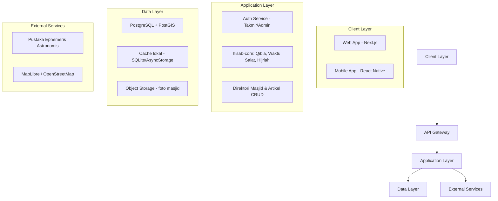

# Technical Design Document: SIFA MVP

## Executive Summary

**System:** SIFA (Sistem Informasi Falak Terintegrasi)
**Version:** MVP 1.0
**Architecture Pattern:** Monorepo dengan package logika bersama (shared core) + full-stack framework
**Estimated Effort:** ±6–8 minggu-orang untuk tim 2–4 mahasiswa (mengikuti jadwal Pertemuan 13–16 modul AIK IV + riset lapangan)

## Architecture Overview

### High-Level Architecture



### Tech Stack Decision

#### Frontend
- **Framework:** Next.js (App Router) + TypeScript
- **Styling:** Tailwind CSS dengan token desain kustom (lihat Design Implementation)
- **State Management:** React Context + hooks ringan (tidak perlu Redux — skala MVP kecil)
- **UI Components:** Komponen kustom di atas Tailwind (hindari framework UI berat yang sulit disesuaikan dengan identitas visual Islami-Kemuhammadiyahan)
- **Testing:** Vitest untuk unit, Playwright untuk E2E

**Alternatif yang dipertimbangkan:**
| Opsi | Kelebihan | Kekurangan | Kenapa tidak dipilih |
|---|---|---|---|
| Remix | SSR kuat, form handling bagus | Ekosistem lebih kecil dari Next.js | Tim lebih familiar dengan Next.js untuk kebutuhan SEO artikel edukasi |
| SvelteKit | Ringan, cepat | Kurva belajar tambahan untuk tim mahasiswa | Next.js + React lebih mudah dipakai ulang di mobile (React Native) |

### Frontend Mobile
- **Framework:** React Native (Expo)
- **Alasan:** satu basis kode Android/iOS, dan yang terpenting — bisa memakai ulang package `hisab-core` (TypeScript) langsung tanpa port ulang ke bahasa lain.

**Alternatif yang dipertimbangkan:**
| Opsi | Kelebihan | Kekurangan | Kenapa tidak dipilih |
|---|---|---|---|
| Flutter | Performa native tinggi, UI konsisten | `hisab-core` harus ditulis ulang di Dart → risiko hasil hisab berbeda dari web | Prinsip produk #3 (satu basis kode logika) lebih penting dari performa UI marginal |
| Native (Kotlin/Swift terpisah) | Performa maksimal | Dua basis kode terpisah, tim kecil tidak sanggup maintain dua platform native | Terlalu berat untuk tim mahasiswa dengan waktu terbatas |

#### Backend
- **Runtime:** Node.js
- **Framework:** Next.js API routes (menyatu dengan web) untuk MVP — cukup ringan, tidak perlu server terpisah dulu
- **ORM/Database:** Prisma + PostgreSQL
- **API Pattern:** REST (lihat Feature Implementation) — dipilih karena lebih sederhana didokumentasikan untuk laporan PKM dibanding GraphQL/tRPC
- **Validation:** Zod

#### Infrastructure
- **Hosting:** Vercel (web, deploy otomatis dari Git) — tingkatan gratis cukup untuk skala MVP
- **Database:** PostgreSQL terkelola (mis. Supabase/Neon tingkatan gratis) + ekstensi PostGIS bila query jarak masjid dibutuhkan
- **Storage:** Penyedia object storage tingkatan gratis (mis. Supabase Storage) untuk foto masjid
- **Monitoring:** Sentry (tingkatan gratis) untuk pelacakan error dasar
- **Peta:** MapLibre + OpenStreetMap (hindari vendor lock-in Google Maps berbayar; wajib atribusi "© OpenStreetMap contributors")

### Perhitungan Astronomis (Ephemeris)
- **Kebutuhan:** deklinasi Matahari, equation of time, posisi geosentris Bulan-Matahari untuk ijtimak, elongasi, dan tinggi hilal.
- **Opsi yang dipertimbangkan:**

| Opsi | Kelebihan | Kekurangan | Rekomendasi |
|---|---|---|---|
| Pustaka ephemeris JS berbasis VSOP87/SPA (mis. adaptasi dari algoritma *praytimes*/*adhan*) | Ringan, jalan di klien, tidak perlu server astronomi khusus | Perlu validasi manual terhadap contoh soal modul | **Direkomendasikan untuk MVP** |
| Layanan API pihak ketiga (hisab-as-a-service) | Setup cepat | Ketergantungan jaringan → melanggar prinsip offline-first (Bagian 4, PRD) | Tidak dipilih |
| Implementasi VSOP87 penuh dari nol | Presisi tertinggi, kontrol penuh | Kompleksitas & waktu implementasi tinggi untuk tim mahasiswa | Opsi jangka panjang pasca-MVP |

**Jujur soal batasan:** presisi hisab bergantung pada kualitas pustaka ephemeris yang dipilih — bukan pada kode `hisab-core` itu sendiri. Golden test case (lihat Testing Strategy) adalah jaring pengaman untuk menangkap kesalahan sebelum rilis, bukan jaminan presisi absolut di semua lokasi Bumi.

## Component Design

### Frontend Architecture
```
apps/web/src/
├── app/                    # App router (Next.js)
│   ├── (public)/
│   │   ├── page.tsx        # Beranda
│   │   ├── kiblat/
│   │   ├── waktu-salat/
│   │   ├── kalender/
│   │   └── edukasi/
│   └── (takmir)/
│       └── verifikasi/
├── components/
│   ├── ui/                 # Base UI: Card, Button, RayRing (motif signature)
│   ├── features/           # KiblatCompass, PrayerCountdown, HijriPanel
│   └── layouts/
├── lib/
│   ├── api/                # klien fetch ke /api
│   ├── hooks/               # useGeolocation, usePrayerTimes
│   └── stores/
├── styles/                 # token warna & tipografi global
└── types/
```

### Backend Architecture
```
apps/web/src/app/api/
├── qibla/route.ts
├── prayer-times/route.ts
├── prayer-times/month/route.ts
├── hijri/route.ts
├── masjid/route.ts
├── masjid/[id]/route.ts
├── masjid/[id]/verify-qibla/route.ts
└── articles/route.ts

packages/hisab-core/src/
├── qibla.ts          # rumus arah kiblat & azimuth
├── prayer-times.ts   # meridian pass, sudut waktu, ikhtiyat
├── hijri.ts          # ijtimak, wujudul hilal, KHGT
├── ephemeris.ts       # wrapper pustaka astronomis pihak ketiga
└── __tests__/
    └── qibla.golden.test.ts   # golden test case modul
```

### Database Schema
```sql
-- Pengguna (Takmir/Admin — jamaah umum tidak perlu akun)
CREATE TABLE users (
    id UUID PRIMARY KEY DEFAULT gen_random_uuid(),
    email VARCHAR(255) UNIQUE NOT NULL,
    peran VARCHAR(20) NOT NULL CHECK (peran IN ('takmir','admin')),
    masjid_id UUID REFERENCES masjid(id),
    created_at TIMESTAMP DEFAULT CURRENT_TIMESTAMP
);

-- Masjid/musala AUM
CREATE TABLE masjid (
    id UUID PRIMARY KEY DEFAULT gen_random_uuid(),
    nama VARCHAR(255) NOT NULL,
    alamat TEXT,
    lat DOUBLE PRECISION NOT NULL,
    lng DOUBLE PRECISION NOT NULL,
    status_verifikasi_kiblat VARCHAR(20) DEFAULT 'belum' CHECK (status_verifikasi_kiblat IN ('belum','terverifikasi','perlu_peninjauan')),
    sudut_kiblat_hasil DOUBLE PRECISION,
    azimuth_kiblat_hasil DOUBLE PRECISION,
    tanggal_verifikasi TIMESTAMP,
    kontak_takmir VARCHAR(100),
    foto_url TEXT,
    created_at TIMESTAMP DEFAULT CURRENT_TIMESTAMP
);

-- Cache jadwal salat (turunan dari hisab-core, boleh dihitung ulang)
CREATE TABLE jadwal_salat (
    id UUID PRIMARY KEY DEFAULT gen_random_uuid(),
    masjid_id UUID REFERENCES masjid(id),
    lat DOUBLE PRECISION,
    lng DOUBLE PRECISION,
    tanggal DATE NOT NULL,
    subuh TIME, terbit TIME, dhuha TIME, zuhur TIME, asar TIME, magrib TIME, isya TIME,
    metode_hisab VARCHAR(50) DEFAULT 'muhammadiyah',
    UNIQUE(masjid_id, tanggal, metode_hisab)
);

-- Status kriteria bulan Hijriah
CREATE TABLE hijriah_bulan (
    id UUID PRIMARY KEY DEFAULT gen_random_uuid(),
    tahun_masehi INT NOT NULL,
    bulan_hijriah VARCHAR(20) NOT NULL,
    wujudul_hilal_terpenuhi BOOLEAN,
    wujudul_hilal_detail JSONB,
    khgt_terpenuhi BOOLEAN,
    khgt_elongasi DOUBLE PRECISION,
    khgt_tinggi_hilal DOUBLE PRECISION,
    tanggal_mulai DATE,
    UNIQUE(tahun_masehi, bulan_hijriah)
);

-- Artikel edukasi
CREATE TABLE artikel_edukasi (
    id UUID PRIMARY KEY DEFAULT gen_random_uuid(),
    judul VARCHAR(255) NOT NULL,
    kategori VARCHAR(50),
    konten TEXT NOT NULL,
    penulis VARCHAR(100),
    tanggal_terbit TIMESTAMP DEFAULT CURRENT_TIMESTAMP
);

-- Log riwayat verifikasi (audit trail untuk laporan PKM)
CREATE TABLE verifikasi_log (
    id UUID PRIMARY KEY DEFAULT gen_random_uuid(),
    masjid_id UUID REFERENCES masjid(id),
    user_id UUID REFERENCES users(id),
    sudut_hasil DOUBLE PRECISION,
    metode VARCHAR(50),
    status VARCHAR(20),
    created_at TIMESTAMP DEFAULT CURRENT_TIMESTAMP
);

-- Indeks untuk performa
CREATE INDEX idx_jadwal_masjid_tanggal ON jadwal_salat(masjid_id, tanggal);
CREATE INDEX idx_masjid_status ON masjid(status_verifikasi_kiblat);
```

## Feature Implementation

### Feature 1: Arah Kiblat

#### API Design
```
GET  /api/qibla?lat=&lng=              // Hitung sudut & azimuth kiblat
POST /api/masjid/:id/verify-qibla      // Ajukan/perbarui verifikasi (perlu peran Takmir)
```

```typescript
// Request/Response types
interface QiblaRequest {
  lat: number; // -90..90
  lng: number; // -180..180
}

interface QiblaResponse {
  sudutArahKiblat: { dms: string; decimal: number }; // mis. "67°31'11.85\""
  azimuthKiblat: { dms: string; decimal: number };
  selisihBujurC: { dms: string; decimal: number };
  kuadran: 'UB' | 'UT' | 'SB' | 'ST';
}
```

#### Business Logic
```typescript
// packages/hisab-core/src/qibla.ts
class QiblaService {
  private readonly KAABAH = { lat: 21.4225, lng: 39.8262 }; // verifikasi ulang sebelum produksi

  hitungArahKiblat(lat: number, lng: number): QiblaResponse {
    // 1. Validasi rentang koordinat -> lempar QiblaError('INVALID_COORDINATES') jika di luar rentang
    // 2. Hitung C (selisih bujur) sesuai aturan tanda (Timur/Barat/antipoda)
    // 3. cotan(AQ) = tan(φK)*cos(φT)/sin(C) - sin(φT)/tan(C)
    // 4. Konversi AQ -> azimuth berdasar kuadran (UB/UT/SB/ST)
    // 5. Kembalikan hasil dalam DMS & desimal
  }
}
```

### Feature 2: Waktu Salat

#### API Design
```
GET /api/prayer-times?lat=&lng=&date=&method=
GET /api/prayer-times/month?lat=&lng=&month=&method=
```

#### Business Logic
```typescript
// packages/hisab-core/src/prayer-times.ts
class PrayerTimesService {
  hitungJadwalHarian(lat: number, lng: number, tanggal: Date, metode: HisabMethod): PrayerTimesResponse {
    // 1. Ambil deklinasi (δ) & equation of time (e) dari ephemeris.ts untuk tanggal berjalan
    // 2. Meridian Pass = 12:00 - e
    // 3. Interpolasi I = (bujurTempat - bujurZona) / 15
    // 4. Zuhur = Meridian Pass - I + ikhtiyat
    // 5. Hitung h0 dinamis untuk Terbit/Magrib: h0 = -(refraksi + semiDiameter + kerendahanUfuk)
    // 6. Turunkan waktu salat lain dari sudut waktu (t) berdasar preset ketinggian matahari `metode`
  }
}
```

### Feature 3: Kalender Hijriah

#### API Design
```
GET /api/hijri?year=&month=
```

#### Business Logic
```typescript
// packages/hisab-core/src/hijri.ts
class HijriahService {
  hitungKriteriaBulan(tahunMasehi: number, bulanHijriah: string): HijriahBulanResponse {
    // 1. Hitung waktu ijtimak (konjungsi geosentris) dari ephemeris.ts
    // 2. Wujudul Hilal: ijtimak terjadi DAN altitude Bulan saat Magrib > 0°
    // 3. KHGT: elongasi Bulan-Matahari >= 8° DAN tinggi hilal >= 5° di titik manapun sebelum 24:00 GMT
    // 4. Kembalikan KEDUA hasil kriteria -- jangan pernah memilih salah satu secara diam-diam
  }
}
```

### Feature 4: Direktori Masjid & Edukasi

#### API Design
```
GET  /api/masjid              // Daftar (filter: kota, status verifikasi)
GET  /api/masjid/:id          // Detail
POST /api/masjid              // Tambah (Admin)
GET  /api/articles            // Daftar artikel (filter kategori)
POST /api/articles            // Tambah/ubah (Admin)
```

Semua endpoint `GET` publik boleh di-cache CDN/edge 24 jam. Format error konsisten di seluruh API:
```json
{ "error": { "code": "INVALID_COORDINATES", "message": "Latitude harus di antara -90 dan 90" } }
```

## Security Implementation

### Authentication & Authorization
```typescript
// Strategi: OAuth pihak ketiga (mis. Google) untuk Takmir/Admin
interface AuthStrategy {
  provider: 'oauth-google';
  tokenExpiry: '1h';
  refreshExpiry: '7d';
}

enum Role { JAMAAH = 'jamaah', TAKMIR = 'takmir', ADMIN = 'admin' }
// Jamaah tidak login sama sekali -- endpoint publik terbuka tanpa token

// Middleware
authenticate() -> validasi token OAuth
authorize(role) -> cek peran sebelum endpoint tulis dieksekusi
rateLimiter() -> 60 permintaan/menit per IP untuk endpoint publik
```

### Data Protection
- Lokasi pengguna **hanya diproses di perangkat** untuk hitung kiblat/waktu salat — tidak dikirim ke server kecuali disimpan sadar sebagai lokasi favorit.
- Endpoint tulis (`POST /api/masjid`, `POST /api/masjid/:id/verify-qibla`) wajib RBAC.
- Kontak takmir di direktori publik dibatasi ke info yang memang untuk dihubungi jamaah.

## Performance Optimization

### Caching Strategy
- **Cache klien (mobile):** SQLite/AsyncStorage untuk jadwal salat 30 hari ke depan — inti dari prinsip offline-first.
- **Cache edge (API publik):** 24 jam untuk `/api/qibla`, `/api/prayer-times`, `/api/hijri`, `/api/masjid`, `/api/articles`.
- **Perhitungan di klien:** kiblat & waktu salat dihitung langsung di perangkat lewat `hisab-core` — API hanya fallback untuk perangkat lambat.

### Optimization Techniques
```typescript
// Hindari hitung ulang hisab tiap render -- memoize per (lat,lng,tanggal,metode)
const jadwal = useMemo(
  () => prayerTimesService.hitungJadwalHarian(lat, lng, tanggal, metode),
  [lat, lng, tanggal, metode]
);
```

## Development Workflow

### AI-Assisted Development Strategy
| Fase | Alat Utama | Alat Cadangan | Tujuan |
|---|---|---|---|
| Arsitektur & desain skema | Claude | — | Pemikiran sistem, validasi rumus terhadap modul |
| Implementasi `hisab-core` | Claude Code | — | Kode presisi tinggi, butuh ketelitian matematis |
| Implementasi UI web/mobile | Claude Code / Cursor | — | Generasi komponen sesuai token desain |
| Debugging | Claude Code | — | Penelusuran error dengan konteks penuh repo |
| Dokumentasi laporan PKM | Claude | — | Menulis ulang bagian teknis jadi bahasa laporan |

### Git Workflow
```
main
├── develop
│   ├── feature/hisab-core-qibla
│   ├── feature/hisab-core-prayer-times
│   ├── feature/hisab-core-hijriah
│   ├── feature/direktori-masjid
│   └── fix/[bug-fix]
```

### Pre-Commit Hooks
- Jalankan format/lint/test sebelum commit (mis. Husky + lint-staged)
- **Wajib:** golden test case kiblat harus lolos sebelum commit ke `hisab-core` diterima

### CI/CD Pipeline
```yaml
# .github/workflows/deploy.yml
name: Deploy
on:
  push:
    branches: [main]
jobs:
  test:
    runs-on: ubuntu-latest
    steps:
      - uses: actions/checkout@v6
      - run: npm ci
      - run: npm test          # termasuk golden test case hisab-core
      - run: npm run build
  deploy:
    needs: test
    runs-on: ubuntu-latest
    steps:
      - uses: actions/checkout@v6
      - run: npm ci --production
      - uses: [deploy-action-vercel]
```

## Testing Strategy

### Test Coverage Targets
- `hisab-core`: 100% pada fungsi kiblat, waktu salat, dan kriteria Hijriah (ini "jantung" produk — kesalahan di sini berarti kesalahan arah ibadah)
- Unit test umum lain: 70–80% pada jalur kritis
- E2E: alur utama (cek kiblat, lihat jadwal salat, buka panel kriteria Hijriah)

### Golden Test Case (Wajib Lolos Sebelum Rilis)
```typescript
// packages/hisab-core/src/__tests__/qibla.golden.test.ts
import { describe, it, expect } from 'vitest';
import { hitungArahKiblat } from '../qibla';

describe('QiblaService — golden test case dari Modul AIK IV BAB II', () => {
  it('menghitung arah kiblat Masjid Subulussalam al-Khoory, Unismuh Makassar', () => {
    const hasil = hitungArahKiblat({
      lat: -5.182089, // -5° 10' 55.52"
      lng: 119.441200, // 119° 26' 28.32"
    });

    expect(hasil.selisihBujurC.decimal).toBeCloseTo(79.6150, 2);   // 79° 36' 53.99"
    expect(hasil.sudutArahKiblat.decimal).toBeCloseTo(67.5200, 2); // 67° 31' 11.85" (UB)
    expect(hasil.azimuthKiblat.decimal).toBeCloseTo(292.4800, 2);  // 292° 28' 48.15"
  });
});
```
> Tambahkan minimal 2 kasus uji lagi dengan koordinat masjid AUM lain dari riset lapangan Fase 0 sebelum dianggap "teruji", agar tidak hanya lolos di satu titik data.

### Visual Verification Loop
Untuk komponen UI (kompas kiblat, panel kriteria Hijriah, mode Layar Masjid), pakai siklus Generate → Render → Inspect → Refine: generate komponen, buka di dev server, ambil screenshot untuk cek kontras & keterbacaan mode TV, lalu perbaiki sebelum commit.

## Deployment

### Environment Configuration
```env
# .env.production
DATABASE_URL=postgresql://...
NEXTAUTH_SECRET=...
GOOGLE_OAUTH_CLIENT_ID=...
GOOGLE_OAUTH_CLIENT_SECRET=...
SENTRY_DSN=...
NEXT_PUBLIC_MAPTILER_KEY=...   # jika pakai basemap MapLibre berbayar-gratis
```

### Deployment Steps
1. Hubungkan repo GitHub ke Vercel (deploy otomatis dari branch `main`)
2. Konfigurasi environment variables di dashboard Vercel
3. Jalankan migrasi database (`prisma migrate deploy`) sebelum deploy pertama
4. Verifikasi golden test case lolos di pipeline CI sebelum promote ke production

## Monitoring & Observability

### Metrics to Track
- **Aplikasi:** waktu respons `/api/qibla` & `/api/prayer-times`, tingkat error
- **Produk:** jumlah verifikasi kiblat berhasil, jumlah masjid aktif di direktori, jumlah pembacaan artikel
- **Infrastruktur:** penggunaan tingkatan gratis database/hosting (agar tidak melampaui kuota tanpa sadar)

### Logging Strategy
```typescript
logger.info({
  event: 'qibla_verified',
  masjidId: masjid.id,
  sudutHasil: hasil.sudutArahKiblat.decimal,
  metode: 'wujudul_hilal_default',
});
```

## Cost Analysis
> **Catatan:** verifikasi harga langsung ke tiap vendor sebelum menyusun anggaran PKM. Tingkatan gratis bisa berubah. Terakhir diverifikasi konsep: Juli 2026.

### Biaya Berjalan (Bulanan — perkiraan tingkat MVP, verifikasi ulang harga)
| Layanan | Tingkatan Contoh | Verifikasi di |
|---|---|---|
| Hosting (Vercel) | Hobby/Gratis cukup untuk MVP | vercel.com/pricing |
| Database (Supabase/Neon) | Gratis untuk skala kecil | supabase.com/pricing atau neon.tech/pricing |
| Monitoring (Sentry) | Developer/Gratis | sentry.io/pricing |
| Peta (MapLibre + OSM) | Gratis (atribusi wajib) | maplibre.org, openstreetmap.org |
| **Total** | **Berpotensi Rp0 di tingkatan gratis** | **Cek halaman harga tiap vendor** |

## Risk Mitigation

| Risk | Probability | Impact | Mitigation |
|---|---|---|---|
| Presisi ephemeris pustaka pihak ketiga tidak memadai di lokasi tertentu | Medium | High | Validasi dengan golden test case + uji lapangan Istiwa'aini sebelum rilis publik |
| Kuota tingkatan gratis hosting/DB terlampaui saat sosialisasi ramai | Low | Medium | Pasang alert billing/kuota sejak awal |
| Ketergantungan sensor GPS/magnetometer perangkat murah | High | Medium | Kalkulator manual sebagai cadangan (lihat PRD, Feature 1) |
| Tim mahasiswa kehabisan waktu sebelum presentasi | Medium | Medium | MVP diprioritaskan ke Fitur 1–2 dulu (lihat PRD, Roadmap) |

## Migration & Scaling Path

### Phase 1: MVP (skala AUM sekitar kampus, puluhan pengguna)
- Arsitektur saat ini (Next.js + Postgres tingkatan gratis) sudah cukup
- Pantau performa saat lonjakan akses menjelang waktu salat/Ramadan

### Phase 2: Pertumbuhan (skala kota/wilayah, ratusan-ribuan pengguna)
- Tambah lapisan cache Redis untuk endpoint yang sering diakses
- Pertimbangkan CDN khusus untuk aset artikel edukasi

### Phase 3: Skala Wilayah Lebih Luas (ribuan+ pengguna, banyak masjid AUM)
- Pisahkan API dari Next.js monolith menjadi layanan tersendiri bila perlu
- Evaluasi kebutuhan multi-region jika direktori masjid meluas ke luar Sulawesi Selatan

## Maintainability & Update Cadence
- Utamakan dependensi stabil, hindari upgrade tanpa alasan jelas
- Tinjau rilis pustaka ephemeris astronomis secara berkala — ini komponen paling sensitif terhadap presisi
- Perbarui `AGENTS.md`/`agent_docs/` seiring proyek berkembang pasca-MVP

## Documentation Requirements
- [ ] Dokumentasi API (mengacu ke bagian Feature Implementation di atas)
- [ ] Dokumentasi skema basis data (bagian Component Design di atas)
- [ ] Panduan deployment (bagian Deployment di atas)
- [ ] Catatan keputusan arsitektur (kenapa monorepo, kenapa React Native, dsb — sudah didokumentasikan sebagai tabel alternatif di tiap keputusan besar)
- [ ] Panduan pakai 1 halaman untuk takmir (dokumen terpisah, bahasa non-teknis)

---
*Version: 1.0*
*Last Updated: 18 Juli 2026*
*Next Review: setelah Fase 0 (riset lapangan) selesai*
*Technical Lead: Tim PKM AIK — Informatika, Unismuh Makassar*
